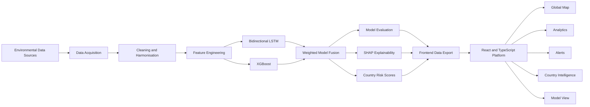

# OutBreakIQ

### Climate-Informed Public-Health Risk Intelligence

OutBreakIQ is an end-to-end research prototype that explores how climate conditions, air quality, geography and environmental persistence can be transformed into interpretable public-health risk intelligence.

The platform combines a hybrid machine-learning pipeline with an interactive web application covering 195 countries. It provides country-level risk scores, environmental trend analysis, global risk visualisation, early-warning feeds, model-performance monitoring and SHAP-based explainability.

> **Research disclaimer:** OutBreakIQ is an experimental research and portfolio project. Its outputs must not be interpreted as medical advice, official epidemiological forecasts or operational public-health alerts.

---

## Project Overview

Climate-sensitive health risks are rarely determined by a single week's weather. Heat, humidity, rainfall and air pollution can accumulate over time and create conditions that affect disease transmission and population vulnerability.

OutBreakIQ explores this relationship through:

* Historical environmental lag features
* Rolling climate indicators
* Seasonal and geographical signals
* An Environmental Memory Score
* A hybrid Bidirectional LSTM–XGBoost model
* Country-level risk intelligence
* SHAP-based model explanations
* An interactive React analytics platform

The current research dataset contains 195 countries, 40 engineered model features, 71,565 training sequences and 18,330 test sequences.

---

## Key Features

### Global Risk Intelligence

* Interactive global risk map
* Country-level risk scores from 0 to 100
* Low, medium, high and critical risk classifications
* Environmental and health-risk summaries
* Top-risk-country monitoring
* Regional risk distribution

### Local Environmental Intelligence

* Location search
* Local weather and environmental context
* Climate-sensitive risk gauge
* Country and location intelligence panels
* Environmental risk-factor breakdowns

### Analytics and Explainability

* SHAP feature-importance visualisation
* Correlation matrix
* Prediction-accuracy analysis
* Training and validation history
* Backtest comparisons
* Model architecture visualisation

### Early-Warning Interface

* Prioritised alert feed
* Regional warning summaries
* Risk-level filtering
* Country-specific intelligence
* Short-, medium- and longer-horizon scenario indicators

### Reporting

* Interactive charts and maps
* Dashboard-level model metrics
* Country intelligence panels
* Browser-based report and visual export support

The application includes dedicated Dashboard, My Location, Global Map, Analytics, Alerts and Model views.

---

## System Architecture



---

## Machine-Learning Pipeline

The ML workflow is divided into four reproducible stages:

```text
step1_download_data.py
    ↓
Acquire and construct environmental and health datasets

step2_train_model.py
    ↓
Engineer features, create temporal sequences and train models

step3_evaluate_model.py
    ↓
Evaluate predictions, create reports and generate visualisations

step4_connect_to_frontend.py
    ↓
Copy validated JSON outputs into the React application
```

### Engineered Features

The pipeline generates 40 features, including:

* Temperature, humidity, rainfall and PM2.5 measurements
* One- to four-week environmental lags
* Four- and eight-week rolling averages
* Rainfall-spike indicators
* Heat index
* AQI approximation
* Week-of-year sine and cosine encodings
* Latitude and tropical-region indicators
* Environmental Memory Score

### Environmental Memory Score

The Environmental Memory Score represents the persistence of recent environmental conditions:

```text
EMS =
    0.30 × normalised two-week temperature lag
  + 0.20 × normalised one-week humidity lag
  + 0.30 × normalised two-week rainfall lag
  + 0.20 × normalised one-week PM2.5 lag
```

### Model Architecture

#### Bidirectional LSTM

The sequential model processes eight-week environmental windows through:

```text
Bidirectional LSTM
    ↓
Dropout
    ↓
LSTM layers
    ↓
Dense layers
    ↓
Risk-score prediction
```

The neural network uses Huber loss, Adam optimisation, early stopping and adaptive learning-rate reduction.

#### XGBoost

The tree-based model captures nonlinear relationships and interactions among the engineered environmental, seasonal and geographical features.

#### Fusion

The current fusion combines:

```text
55% Bidirectional LSTM prediction
45% XGBoost prediction
```

The hybrid design was created to combine temporal learning with structured tabular modelling.

---

## Current Evaluation Results

The stored evaluation report contains the following prototype results:

| Metric                         |          Fusion result |
| ------------------------------ | ---------------------: |
| Mean Absolute Error            | 2.22 risk-score points |
| Root Mean Squared Error        |                   2.91 |
| Mean Absolute Percentage Error |                  8.58% |
| Predictions within ±10%        |                 59.62% |
| Predictions within ±25%        |                 98.08% |
| R²                             |                 −0.258 |
| Countries represented          |                    195 |
| Engineered features            |                     40 |
| Sequence length                |                8 weeks |

### Interpretation

Although the MAE and percentage-error metrics indicate relatively small absolute errors on the current risk-score scale, the negative R² shows that the model does not yet explain unseen variance better than a simple mean baseline in the evaluated backtest.

The stored comparison also shows that the standalone XGBoost model currently produces a lower MAE than the weighted fusion model. Future work will therefore focus on improving temporal validation, tuning the fusion strategy and evaluating against stronger naive and statistical baselines.

---

## Data Sources and Scope

| Source                    | Role in the project                                           |
| ------------------------- | ------------------------------------------------------------- |
| NASA POWER                | Climate observations for selected geographic anchor locations |
| OpenAQ                    | Air-quality observations where retrieval is available         |
| DengAI                    | Reference dengue dataset used for experimentation             |
| Geographic metadata       | Country location, latitude and regional features              |
| Engineered disease burden | Experimental global health-risk target construction           |

### Data Transparency

Consistent weekly disease-surveillance labels are not publicly available for every country in a uniform format. The current version therefore uses synthetic and engineered disease-burden values to test the architecture across 195 countries.

Additional limitations include:

* Climate values for many countries are interpolated from representative anchor locations.
* Synthetic variation is applied where direct country-level measurements are unavailable.
* PM2.5 values can use a synthetic fallback when OpenAQ retrieval fails.
* DengAI is retained as a reference dataset and is not currently merged into the global model-training table.
* The 7-, 30- and 90-day dashboard values are experimental scenario projections rather than separately trained forecasting horizons.
* Country risk tiers are intended for interface demonstration and research analysis.

These limitations mean the present system should be evaluated as a research prototype rather than a validated epidemiological surveillance platform.

---

## Technology Stack

### Machine Learning and Data

* Python
* TensorFlow
* XGBoost
* scikit-learn
* pandas
* NumPy
* SHAP
* Matplotlib
* Joblib

### Frontend

* React
* TypeScript
* Vite
* Tailwind CSS
* Zustand
* D3.js
* Recharts
* React Simple Maps
* Framer Motion
* jsPDF
* html2canvas

### Development Authentication API

* Node.js
* Native HTTP server
* Token-based development authentication

---

## Model Outputs

The pipeline generates:

```text
model_metrics.json
evaluation_report.json
training_history.json
backtest_predictions.json
shap_importance.json
country_risk_scores.json
```

These files supply the dashboard, model view, global map, analytics panels and country-intelligence interface.

---
